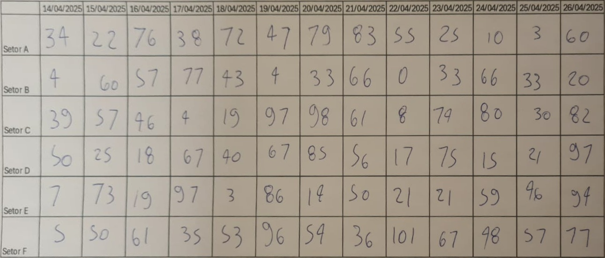

# Extração de Tabelas por Transformação de Perspectiva
### Projeto para a disciplina de Visão Computacional T03 - UFPR

Este projeto implementa uma solução simples para extrair tabelas de imagens de documentos fotografados, corrigindo distorções de perspectiva utilizando técnicas clássicas de Visão Computacional com OpenCV e Python.

A ideia principal é detectar os cantos da tabela, aplicar uma transformação perspectiva para retificar a imagem e facilitar a extração automatizada dos dados contidos.

## Imagem original

## Resultado após transformação perspectiva

---

Feito para estudo e demonstração de processamento básico de imagens e correção de perspectiva.
